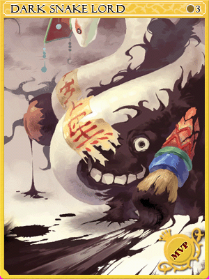
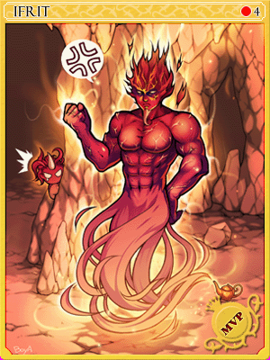
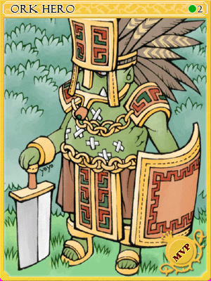
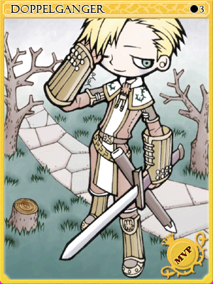
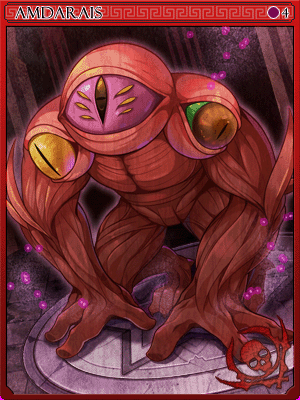
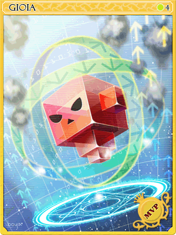

# Legend
✔️ Already implemented  
🔷 Already implemented, effect was modified  
🔶 Item implemented, combo does not work  
🔺 Not yet implemented  
🔰 Is an enchant, not a gear  
❌ Card ID is different than that of other servers  
⭕ Combo is with an in-game item, but the item's ID is different than that of other servers

---
## High Priest

  

  https://divine-pride.net/database/item/29724/ 🔰
  

  
  - Enchants left untranslated
  

---
## Arch Bishop Margaretha ❌

  

  https://divine-pride.net/database/item/29724/ 🔰
  

  
  - Enchants left untranslated
  

---
## Creator

  

  https://divine-pride.net/database/item/29724/ 🔰
  

  
  - Enchants left untranslated
  

---
## Genetic Flamel ❌

  

  https://divine-pride.net/database/item/29724/ 🔰
  

  
  - Enchants left untranslated
  

---
## Assassin Cross

  

  https://divine-pride.net/database/item/29724/ 🔰
  

  
  - Enchants left untranslated
  

---
## Guillotine Cross Eremes ❌

  

  https://divine-pride.net/database/item/29724/ 🔰
  

  
  - Enchants left untranslated
  

---
## Clown

  

  https://divine-pride.net/database/item/29724/ 🔰
  

  
  - Enchants left untranslated
  

---
## Maestro Alphoccio ❌

  

  https://divine-pride.net/database/item/29724/ 🔰
  

  
  - Enchants left untranslated
  

---
## Mastersmith

  

  https://divine-pride.net/database/item/29724/ 🔰
  

  
  - Enchants left untranslated
  

---
## Mechanic Howard ❌

  

  https://divine-pride.net/database/item/29724/ 🔰
  

  
  - Enchants left untranslated
  

---
## Sniper

  

  https://divine-pride.net/database/item/29724/ 🔰
  

  
  - Enchants left untranslated
  

---
## Ranger Cecil ❌

  

  https://divine-pride.net/database/item/29724/ 🔰
  

  
  - Enchants left untranslated
  

---
## Paladin

  

  https://divine-pride.net/database/item/29724/ 🔰
  

  
  - Enchants left untranslated
  

---
## Royal Guard Randel ❌

  

  https://divine-pride.net/database/item/29724/ 🔰
  

  
  - Enchants left untranslated
  

---
## Lord Knight

  

    <a href="https://divine-pride.net/database/item/19446/1">
      Injured_Eyepatch_JP_ [1] 🔺
    </a>
  

  
  - Increase movement speed
  - While in Frenzy state
    + Add a chance of transforming into Lord Knight Seyren for 5 seconds
    + Atk +1000 while transformed
  

  

    <a href="https://divine-pride.net/database/item/19445/">
      Injured_Eyepatch_JP 🔺
    </a>
  

  
  - Increase movement speed
  - While in Frenzy state
    + Add a chance of transforming into Lord Knight Seyren for 5 seconds
    + Atk +1000 while transformed
  

  

  https://divine-pride.net/database/item/29724/ 🔰
  

  
  - Enchants left untranslated
  

---
## Rune Knight Seyren ❌

  

  https://divine-pride.net/database/item/29724/ 🔰
  

  
  - Enchants left untranslated
  

---
## Stalker

  

  https://divine-pride.net/database/item/29724/ 🔰
  

  
  - Enchants left untranslated
  

---
## Shadow Chaser Gertie ❌

  

  https://divine-pride.net/database/item/29724/ 🔰
  

  
  - Enchants left untranslated
  

---
## Professor

  

    <a href="https://divine-pride.net/database/item/15387/1">
      Jirant_Dress 🔺
    </a>
  

  
  - Immunity to Frozen
  - Reduce castimg time of Psychic Wave by 100%
  - Disable Magnetic Earth autocast
  

  

  https://divine-pride.net/database/item/29724/ 🔰
  

  
  - Enchants left untranslated
  

---
## Sorcerer Celia ❌

  

  https://divine-pride.net/database/item/29724/ 🔰
  

  
  - Enchants left untranslated
  

---
## Champion

  

  https://divine-pride.net/database/item/29724/ 🔰
  

  
  - Enchants left untranslated
  

---
## Sura Chen ❌

  

  https://divine-pride.net/database/item/29724/ 🔰
  

  
  - Enchants left untranslated
  

---
## High Wizard

  

    <a href="https://divine-pride.net/database/item/19272/1">
      Garden of Eden [1] 🔺
    </a>
  

  
  - Reduce variable cast time by 100%
  - Reduce cooldown of Intense Telekinesis by 120 seconds
  - Cancel Intense Telekinesis when unequipped
  

  

  https://divine-pride.net/database/item/29724/ 🔰
  

  
  - Enchants left untranslated
  

---
## Warlock Kathryne ❌

  

  https://divine-pride.net/database/item/29724/ 🔰
  

  
  - Enchants left untranslated
  

---
## Gypsy

  

  https://divine-pride.net/database/item/29724/ 🔰
  

  
  - Enchants left untranslated
  

---
## Wanderer Trentini ❌

  

  https://divine-pride.net/database/item/29724/ 🔰
  

  
  - Enchants left untranslated
  

---
## Atroce

  

  https://divine-pride.net/database/item/311073/ 🔰
  

  
  - Enchants left untranslated
  

---
## Detardeurus

  

  https://divine-pride.net/database/item/311439/ 🔰
  

  
  - Enchants left untranslated
  

---
## Gloom Under Night

  

  https://divine-pride.net/database/item/311073/ 🔰
  

  
  - Enchants left untranslated
  

---
## Tao Gunka

  

  https://divine-pride.net/database/item/311439/ 🔰
  

  
  - Enchants left untranslated
  

---

  

  https://divine-pride.net/database/item/311439/ 🔰
  

  
  - Enchants left untranslated
  

---
## Samurai Spectre

  

    <a href="https://divine-pride.net/database/item/13473/1">
      Gods_Sword ✔️
    </a>
  

  - ASPD +10%
  - ATK +20%
  - When casting Soul Destoyer, Perfect Dodge +100 for 3 seconds
  

  

    <a href="https://divine-pride.net/database/item/500005/1">
      Magic_Sword_J ✔️
    </a>
  

  
  - ASPD +10%
  - ATK +20%
  - When casting Soul Destoyer, Perfect Dodge +100 for 3 seconds

  

  https://divine-pride.net/database/item/311439/ 🔰
  

  
  - Enchants left untranslated
  

---
## Evil Snake Lord

  

  https://divine-pride.net/database/item/311439/ 🔰
  

  
  - Enchants left untranslated
  

---
## RSX-0806

  

    <a href="https://divine-pride.net/database/item/15137/1">
      Tatenashi Armor [1] ✔️
    </a>
  

  
  - Vit +5 per refine
  - HP +5% per refine
  

  

  https://divine-pride.net/database/item/311439/ 🔰
  

  
  - Enchants left untranslated
  

---
## Lord of the Dead

  

  https://divine-pride.net/database/item/311439/ 🔰
  

  
  - Enchants left untranslated
  

---
## Valkyrie Randgris

  

    <a href="https://divine-pride.net/database/item/500009/1">
      Copy_Gram ✔️
    </a>
  

  
  - If base level is 99 or lower  
    + Increase damage dealt with Holy elemental magic by 15%
    + Increase resistance to Stun by 20%
    + Increase resistance to Silcene by 20%
  
  - If base level is 100 or higher  
    + Increase damage dealt with Holy elemental magic by 50%
    + Increase resistance to Stun by 50%
    + Increase resistance to Silcene by 50%  
  

  

  https://divine-pride.net/database/item/311439/ 🔰
  

  
  - Enchants left untranslated
  

---
## Ifrit

  

    <a href="https://divine-pride.net/database/item/480023/1">
      Arabian Manteau [1] ✔️
    </a>
  

  
  - Increase resistance to fire property attacks by 100%  
  - Reduce incoming damage of Critical Slash by 100%
  

  

  https://divine-pride.net/database/item/311073/ 🔰
  

  
  - Enchants left untranslated
  

---
## Fenrir

  

    <a href="https://divine-pride.net/database/item/400101/1">
      Gate of Netherworld [1] ✔️
    </a>
  

  
  - Int +30  
  - Dex +30  
  - Reduce fixed casting time of Tetra Vortex by 100%
  

  

  https://divine-pride.net/database/item/311074/ 🔰
  

  
  - Enchants left untranslated
  

---
## Ktullanux

  

    <a href="https://divine-pride.net/database/item/15421/1">
      Okami Robe [1] ✔️
    </a>
  

  
  - Immunity to Freezing   
  - Increase physical damage dealt to Fire element targets by 5% per refine  
  - Add a chance of curing Freezing and Frozen status when receiving damage  
  - Add a chance to reduce Water elemental damage by 100%
  

  

    <a href="https://divine-pride.net/database/item/450158  1">
      Awakened Okami Robe [1] 🔺
    </a>
  

  
  - Immunity to Freezing   
  - Increase physical damage dealt to Fire element targets by 8% per refine  
  - Add a chance of curing Freezing and Frozen status when receiving damage  
  - Add a chance to reduce Water elemental damage by 100%
  

---
## Osiris

  

    <a href="https://divine-pride.net/database/item/20932/1">
      Old Morroc Shawl [1] ✔️
    </a>
  

  
  - HP +15%  
  - Immunity to Curse  
  - Increase resistance to Fire property attacks by 50%  
  - Increase resistance to Shadow property attacks by 100%  
  

  

  https://divine-pride.net/database/item/311072/ 🔰
  

  
  - Enchants left untranslated
  

---
## Phreeoni

  

    <a href="https://divine-pride.net/database/item/20859/1">
      Phreeoni Wings [1] ✔️
    </a>
  

  
  - Perfect Hit +50  
  - Immunity to Stone Curse  
  

  

  https://divine-pride.net/database/item/311072/ 🔰
  

  
  - Enchants left untranslated
  

---
## Vesper

  

    <a href="https://divine-pride.net/database/item/19436/1">
      Vesper Headgear [1] ✔️
    </a>
  

  
  - Ignore MDef of boss monsters by 70%    
  - Increase Holy property magical damage by 30%  
  - Increase Neutral property magical damage by 30%  
  

  

  https://divine-pride.net/database/item/311439/ 🔰
  

  
  - Enchants left untranslated
  

---
## Orc Hero

  

    <a href="https://divine-pride.net/database/item/19444/1">
      Star Eyepatch [1] 🔷
    </a>
  

  
  - If base level is 99 or lower  
    + Atk +10 per 10 base Vit  
    + MAtk +10 per 10 base Vit  
    + Vit +1 per 10 base Luk  
    + Luk +1 per 10 base Luk  
  
  - If base level is 100 or higher  
    + Atk +15 per 10 base Vit  
    + MAtk +15 per 10 base Vit  
    + Vit +1 per 10 base Luk  
    + Luk +1 per 10 base Luk  
  

  

    <a href="https://divine-pride.net/database/item/19443/">
      Star Eyepatch 🔺
    </a>
  

  
  - If base level is 99 or lower  
    + Atk +10 per 10 base Vit  
    + MAtk +10 per 10 base Vit  
    + Vit +1 per 10 base Luk  
    + Luk +1 per 10 base Luk  
  
  - If base level is 100 or higher  
    + Atk +30 per 10 base Vit  
    + MAtk +30 per 10 base Vit  
    + Vit +3 per 10 base Luk  
    + Luk +3 per 10 base Luk 
  

---
## Doppelganger

  

    <a href="https://divine-pride.net/database/item/21053/1">
      Full Force [1] ✔️
    </a>
  

  
  - Enable use of Lex Aeterna level 1  

  - If base level is 99 or lower  
    + Atk 4% per refine  
    + ASPD 2% per refine  
  
  - If base level is 100 or higher  
    + Atk 10% per refine  
    + ASPD 5% per refine  
  

  

    <a href="https://divine-pride.net/database/item/600025/1">
      Awakened Full Force [1] 🔺
    </a>
  

  
  - Enable use of Lex Aeterna level 1  
  - Add a chance of casting Ignition Break level 5 when physically attacking

  - If base level is 99 or lower  
    + Atk 4% per refine  
    + ASPD 2% per refine  

  - If base level is 100 or higher  
    + Atk 10% per refine  
    + ASPD 5% per refine  
  

---
## Fallen Bishop

  

    <a href="https://divine-pride.net/database/item/470112/1">
      Moaning of Evil Spirits [1] 🔷
    </a>
  

  
  - Increase magical damage dealt to Doram race targets by 50%
  - Add a chance of inflicting Curse when dealing magical damage
  - Reduce damage taken from reflected damage by 10% per refine
  

  

    https://divine-pride.net/database/item/311073/ 🔰
  

  
  - Enchants left untranslated
  

---
## Kraken

  

    <a href="https://divine-pride.net/database/item/28520/1">
      Egir Ring [1] 🔶
    </a>
  

  
  - MDef +15
  - Flee +100
  - HP +15%
  - Enable the use of Stalk level 1
  - Show hidden characters
  

---
# Beelzebub

  

    <a href="https://divine-pride.net/database/item/22212/1">
      Hollow Shoes [1] 🔺
    </a>
  

  
  - Enable the use of Magnus Exorcismus level 10
  - Increase magical damage dealt to Demon race targets by 30%
  - Increase magical damage dealt to Undead race targets by 30%
  - Increase magical damage dealt to Undead element targets by 30%
  - Increase magical damage dealt to Shadow element targets by 30%
  
  - If base level is 99 or lower  
    + MAtk +5 per refine
    + Reduce variable casting time by 2% per refine

  - If base level is 100 or higher  
    + MAtk +15 per refine
    + Reduce variable casting time by 7% per refine

  

    <a href="https://divine-pride.net/database/item/470113/1">
      Awakened Hollow Shoes [1] 🔺
    </a>
  

  
  - Add a chance of activating Kaahi level 7 on the user for 30 seconds when magically attacking

  - Increase magical damage to all element targets by 1% per 10 Luk

  - If base Luk is 130
    + Increase magical damage to all element targets by 25%

  - If base level is 99 or lower  
    + MAtk +5 per refine
    + Reduce variable casting time by 2% per refine

  - If base level is 100 or higher  
    + MAtk +15 per refine
    + Reduce variable casting time by 7% per refine

  

    https://divine-pride.net/database/item/311073/ 🔰
  

  
  - Enchants left untranslated
  

---
## Nightmare Amon Ra

  

    <a href="https://divine-pride.net/database/item/450163/1">
      White Lily Robe [1] 🔺
    </a>
  

  
  - Immunity to Frozen 
  - Enable the use of Judex level 3
  - Increase damage dealt with Holy elemental magic by 15%

  

    <a href="https://divine-pride.net/database/item/450181/1">
      Awakened White Lily Robe [1] 🔺
    </a>
  

  
  - Immunity to Frozen 
  - Enable the use of Judex level (refine level)
  - Increase damage dealt with Holy elemental magic by 50%

  

  https://divine-pride.net/database/item/311075/ 🔰
  

  
  - Enchants left untranslated
  

---
## Gold Queen Scaraba

  

    <a href="https://divine-pride.net/database/item/19023/1">
      Queen Scaraba Crown [1] 🔺
    </a>
  

  
  - Immunity to Confusion
  - Reduce damage received from Insect race targets by 10%

  

  https://divine-pride.net/database/item/311075/ 🔰
  

  
  - Enchants left untranslated
  

---
## Weird Coelacanth

  

    <a href="https://divine-pride.net/database/item/450005/1">
      Primordial Scale [1] 🔺
    </a>
  

  
  - Immunity to Frozen
  - Increase the damage of Storm Gust by 200%
  - Reduce castimg time of Storm Gust by 100%

---
## Corruption Root

  

  https://divine-pride.net/database/item/311075/ 🔰
  

  
  - Enchants left untranslated
  

---
## Evil Fanatic

  

  https://divine-pride.net/database/item/311075/ 🔰
  

  
  - Enchants left untranslated
  

---
## Ferlock

  

  https://divine-pride.net/database/item/311075/ 🔰
  

  
  - Enchants left untranslated
  

---
## Amdarais

  

  https://divine-pride.net/database/item/311075/ 🔰
  

  
  - Enchants left untranslated
  

---
## Nidhoggur's Shadow

  

    <a href="https://divine-pride.net/database/item/15194/1">
      Abusive Robe (JRO) [1] ⭕
    </a>
  

  
  - Immunity to Frozen
  - Gain 200 HP and 20 SP when killing a monster
  

  

  https://divine-pride.net/database/item/311075/ 🔰
  

  
  - Enchants left untranslated
  

---
## Ominous Turtle General

  

  https://divine-pride.net/database/item/311075/ 🔰
  

  
  - Enchants left untranslated
  

---
## Angry Moonlight Flower

  

  https://divine-pride.net/database/item/311075/ 🔰
  

  
  - Enchants left untranslated
  

---
## Awakened Ktullanux

  

  https://divine-pride.net/database/item/311075/ 🔰
  

  
  - Enchants left untranslated
  

---
## Angry Dracula

  

  https://divine-pride.net/database/item/311075/ 🔰
  

  
  - Enchants left untranslated
  

---
## Entweihen

  

    <a href="https://divine-pride.net/database/item/19282/1">
      Consultation Robe (JRO) [1] ⭕
    </a>
  

  
  - Immunity to Frozen
  - Increase damage of Meteor Storm by 50%
  

---
## Bijou ❌

  

  https://divine-pride.net/database/item/311074/ 🔰
  

  
  - Enchants left untranslated
  

---
## Awakened Ferre ❌

  

  https://divine-pride.net/database/item/311074/ 🔰
  

  
  - Enchants left untranslated
  

---
## Faceworm Queen ❌

  

  https://divine-pride.net/database/item/311074/ 🔰
  

  
  - Enchants left untranslated
  

---
## Stephen Jack Ernest Wolf ❌

  

  https://divine-pride.net/database/item/311074/ 🔰
  

  
  - Enchants left untranslated
  

---
## Sarah ❌

  

  https://divine-pride.net/database/item/311074/ 🔰
  

  
  - Enchants left untranslated
  

---
## Corruption Root H ❌

  

  https://divine-pride.net/database/item/311074/ 🔰
  

  
  - Enchants left untranslated
  

---
## Amdarais H ❌

  

  https://divine-pride.net/database/item/311074/ 🔰
  

  
  - Enchants left untranslated
  

---
## Heart Hunter Evil ❌

  

  https://divine-pride.net/database/item/311883/ 🔰
  

  
  - Enchants left untranslated
  

---
## Cutie ❌

  

  https://divine-pride.net/database/item/311883/ 🔰
  

  
  - Enchants left untranslated
  

---
## Celine Kimi ❌

  

  https://divine-pride.net/database/item/311883/ 🔰
  

  
  - Enchants left untranslated
  

---
## T_W_O ❌

  

  https://divine-pride.net/database/item/311883/ 🔰
  

  
  - Enchants left untranslated
  

---
## Charleston ❌

  

  https://divine-pride.net/database/item/311883/ 🔰
  

  
  - Enchants left untranslated
  

---
## Gioia ❌

  

  https://divine-pride.net/database/item/310321/ 🔰
  

  
  - Enchants left untranslated
  

---
## Kades ❌

  

  https://divine-pride.net/database/item/310321/ 🔰
  

  
  - Enchants left untranslated
  

---
## Pyuriel ❌

  

  https://divine-pride.net/database/item/310321/ 🔰
  

  
  - Enchants left untranslated
  

---
## Daehyon ❌

  

  https://divine-pride.net/database/item/310321/ 🔰
  

  
  - Enchants left untranslated
  

---
## Miguel ❌

  

  https://divine-pride.net/database/item/311883/ 🔰
  

  
  - Enchants left untranslated
  

---
## EL-A17T ❌

  

  https://divine-pride.net/database/item/311883/ 🔰
  

  
  - Enchants left untranslated
  

---
## Buwaywa ❌

  

  https://divine-pride.net/database/item/311439/ 🔰
  

  
  - Enchants left untranslated
  

---
## Bangungot ❌

  

  https://divine-pride.net/database/item/311439/ 🔰
  

  
  - Enchants left untranslated
  

---
## Bakonawa ❌

  

  https://divine-pride.net/database/item/311439/ 🔰
  

  
  - Enchants left untranslated
  

